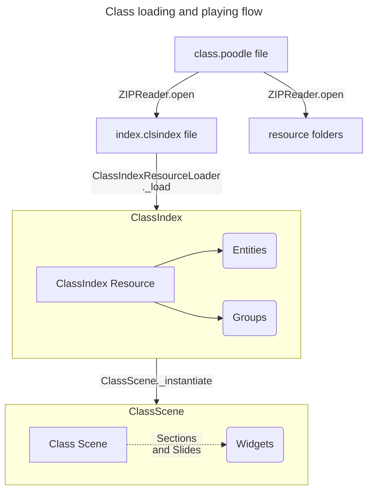
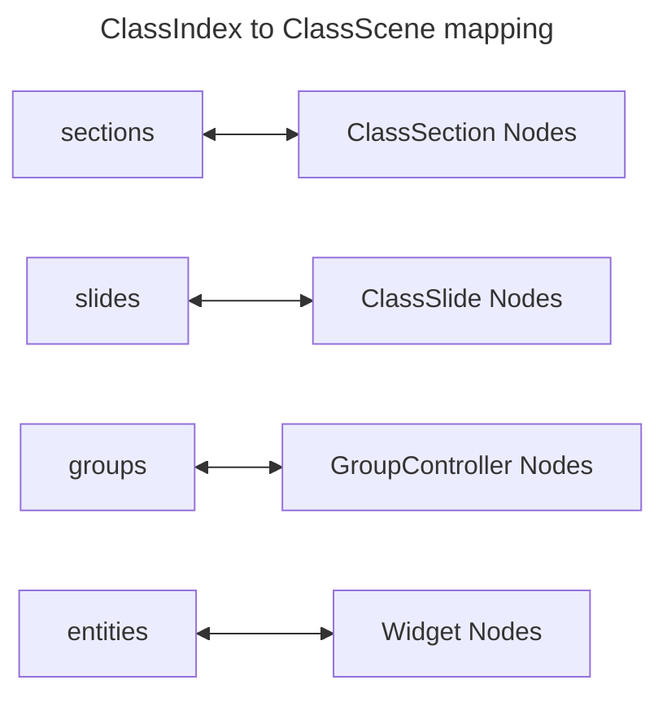

# Architecture

## Overview

This document describes the architecture of the system. It is intended to provide a high-level overview of the system's components and their interactions.

## Components

The system consists of the following components:
* Class File: Is a file with `.poodle` extension that contains all the files for a class to be read by the POODLE Player. It is internally a `zip` file that contains the class files and the resources. See [Class File](class_file.md) for more information on the file format.
* Parser: Reads the class file and creates a class Resource that can be used by the POODLE Player.
* Class Resource: Represents a class that can be played by the POODLE Player. It contains all the resources and entities needed to play the class.
* Class Scene: Represents the playable class as a scene in the POODLE Player. It contains all the nodes ready to play the class.
* Class Player: Plays the class scene in the POODLE Player. It is responsible for managing the class scene and the player's interactions with it.

## Interactions and flow

### Flow Overview

The following diagram shows an overview of the interactions between the components of the system to load and play a class:

This way, the flow of the system is as follows:
* The `class.poodle` file is read by the `ZIPReader` to get the `index.clsindex` file and the resource folders.
* The `index.clsindex` file is loaded by the `ClassIndexResourceLoader` to create a `ClassIndex` Resource object.
* The `ClassScene` is instantiated and receives the `ClassIndex` Resource, then uses it to instantiate the needed `Widgets` that are used to play the class.

### Detailed Flow

To explain a bit more the flow of the system, the following sections shows the detailed interactions in each step:

#### Class File Loading

The `class.poodle` file is a zip file that contains all the resources and files needed to play a class. The file is read by the [`ZIPReader` class](https://docs.godotengine.org/en/stable/classes/class_zipreader.html) that exposes functions that can extract individual files inside the zip archive.
The `ZIPReader` is used to extract the `index.clsindex` file first and it is sent to the [resource loader step](#class-index-resource-loading). The `ZipReader` instance is stored as it is used in a further step.

#### Class Index Resource Loading

The `index.clsindex` file is a JSON file that contains the data, metadata and structure of the class. It is loaded by the `ClassIndexResourceLoader` class that reads the file and creates a `ClassIndex` Resource object that contains all the data of the file in a structured way. This step relies in the ``CustomClassDB`` singleton to instantiate custom classes and resources. See PENDING REFERENCE for more information on custom classes and resources.

#### Class Scene Instantiation

The `ClassScene` is the main scene that represents the class to be played. It receives the `ClassIndex` Resource and uses it to instantiate the needed `Node` structure to play the class. Following the same structure of the `ClassIndex` Resource, the `ClassScene` maps the entities and groups to the corresponding `Widgets` and `GroupControllers` that are used to play the class:

The `GroupController`s are special node types that are used to manage the groups of widgets in the class. They can contain other `GroupController`s or `Widget`s as children. The `GroupController` is responsible for managing the playback behavior of its children. POODLE provides a set of default `GroupController` nodes that can be used to create basic playback behavior:
* `ChainGroupController` plays its children one after another
* `ParallelGroupController` plays its children in parallel

Custom `GroupController` nodes can be created to implement custom playback behavior.

The `Widget` nodes are the nodes that represent the entities in the class. They can be of different types, such as `TextWidget`, `ImageWidget`, `AudioWidget`, `LineWidget` etc. Each `Widget` node is responsible for displaying the entity it represents and handling user interactions with it.

